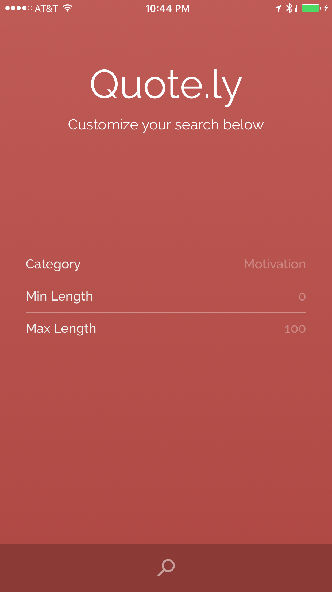

# Synopsis

Quote.ly is a simple quotes app for iOS that allows you to quickly retrieve a quote about a certain topic and of a certain length. It uses the [They Said So Quotes API](https://theysaidso.com/api/#), but it could easily be adapted to use another service for retrieving quotes.

# Installation

1. Register for an API Key [here](https://theysaidso.com/register#)
2. Create a new plist file in the 'Supporting Files' group called API-Keys.plist. Add a new item with the key "TheySaidSo" and your api key as the value.